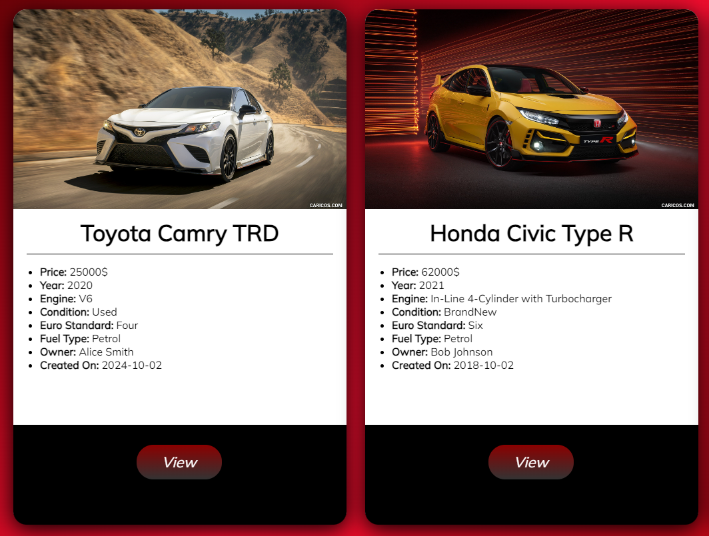
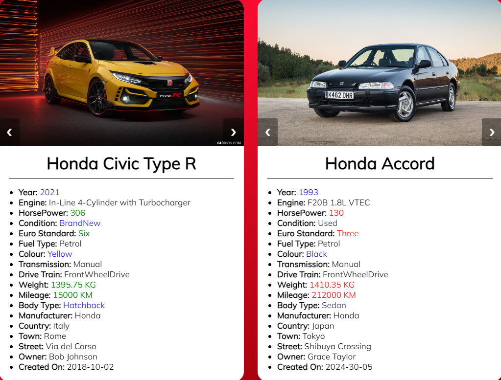

# Xcelerate

Xcelerate is a dynamic and user-friendly web application designed for car enthusiasts and dealerships. Built using the robust and scalable ASP.NET MVC framework, Xcelerate provides a platform for users to explore, buy, and sell cars in an efficient and secure manner.

# Functionalities

- **Previewing Cars:** This functionality allows users to browse and explore a wide range of cars available on the platform. Users can view detailed information about each car, including specifications, features, images, and pricing. The preview feature provides users with a glimpse of the available inventory, helping them make informed decisions before making a purchase or sale.

- **Buying Cars:** With the buying functionality, users can search for specific cars based on their preferences, such as make, model, year, price range, and more. Once users find a car they are interested in, they can initiate the buying process directly through the platform. This may involve contacting sellers, scheduling test drives, negotiating prices, and completing the purchase transaction securely within the application.

!

- **Selling Cars:** This functionality enables users to list their cars for sale on the Xcelerate platform. Sellers can create detailed listings for their cars, including descriptions, images, pricing, and contact information. The selling feature streamlines the process of reaching potential buyers, managing inquiries, and facilitating the sale transaction. Sellers can effectively showcase their cars to a targeted audience, maximizing their chances of finding a buyer quickly.

- **Comparing Cars:** The comparing functionality allows users to compare multiple cars side by side to evaluate their features, specifications, and pricing. Users can select specific cars from the inventory and view a comprehensive comparison chart highlighting key differences and similarities. This feature helps users make well-informed decisions by providing a clear overview of the available options and assisting them in choosing the best car that meets their requirements and preferences.

